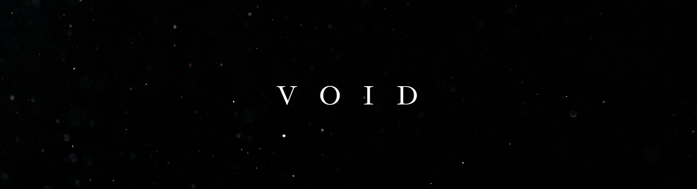

---

## Meow Meow !

### Our Kittens
##### - Deepak
##### - Satyam
##### - Piyush

### Techstack
💙 React , 💜 Linux  , 🩵 Tailwind , 💚 Node , 🤎 Sublime Text

<!--

**Here are some ideas to get you started:**

🙋‍♀️ A short introduction - what is your organization all about?
🌈 Contribution guidelines - how can the community get involved?
👩‍💻 Useful resources - where can the community find your docs? Is there anything else the community should know?
🍿 Fun facts - what does your team eat for breakfast?
🧙 Remember, you can do mighty things with the power of [Markdown](https://docs.github.com/github/writing-on-github/getting-started-with-writing-and-formatting-on-github/basic-writing-and-formatting-syntax)
-->

   

## Project
- [✏️ Kagad](https://me0w-me0w-me0w.github.io/kagad/)
- 

